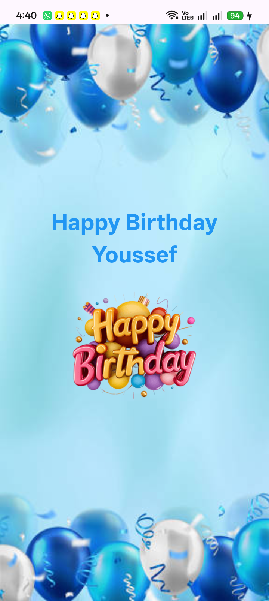

🎂 Birthday Card App

A simple Birthday Card mobile application built with Flutter.

This project was created as my first Flutter application to practice the fundamentals of Flutter and understand how different widgets work together to build a simple user interface.

🎯 Project Objectives

The main objectives of this project were to practice:

Understanding the Flutter widget system

Using StatelessWidget

Understanding the build() method

Using MaterialApp

Using Scaffold

Using SafeArea

Building layered interfaces with Stack

Organizing widgets vertically using Column

Using Center for widget alignment

Displaying local images using AssetImage

Using BoxFit.cover

Styling text using TextStyle

Creating a simple responsive layout

✨ Features

🎂 Birthday greeting message

🖼️ Full-screen background image

📝 Customized birthday text

🖼️ Additional image displayed below the greeting

📱 Simple and responsive layout

⚡ Clean and minimal user interface

🛠️ Technologies Used

Flutter

Dart

Material Design

Flutter Widgets Used

MaterialApp

Scaffold

SafeArea

Stack

Column

Center

Text

Image

AssetImage

Other Concepts

StatelessWidget

BoxFit.cover

TextStyle

Local Assets

📂 Project Structure

birthday-card/ │ ├── lib/ │ └── main.dart │ ├── assets/ │ └── images/ │ ├── brithday_image.jpg │ ├── text.png │ └── ScreenShot.png │ ├── pubspec.yaml └── README.md 

📱 App Preview

 

🧠 What I Learned

This project helped me understand the basic structure of a Flutter application and how Flutter widgets can be combined to create a user interface.

Through this project, I practiced:

Creating a Flutter application

Understanding main() as the entry point of the application

Using runApp() to start the Flutter application

Creating a StatelessWidget

Understanding the role of the build() method

Building a UI using Flutter's widget tree

Creating layered layouts using Stack

Using Column to arrange widgets vertically

Using Center to align widgets

Using local image assets

Styling and aligning text

Using BoxFit.cover for background images

🚀 Getting Started

Prerequisites

Before running this project, make sure you have:

Flutter SDK

Android Studio or Visual Studio Code

Flutter and Dart extensions

You can check your Flutter installation using:

flutter doctor 

Installation

Clone the repository

git clone https://github.com/youssefmohamedflutter/birthday-card.git 

Navigate to the project directory

cd birthday-card 

Install dependencies

flutter pub get 

Run the application

flutter run 

👨‍💻 Author

Youssef Mohamed Flutter Developer

💼 LinkedIn: youssef-gado

💻 GitHub: youssefmohamedflutter

⭐ Support

If you like this project, don't forget to give the repository a star ⭐.

📄 License

This project is licensed under the MIT License.

